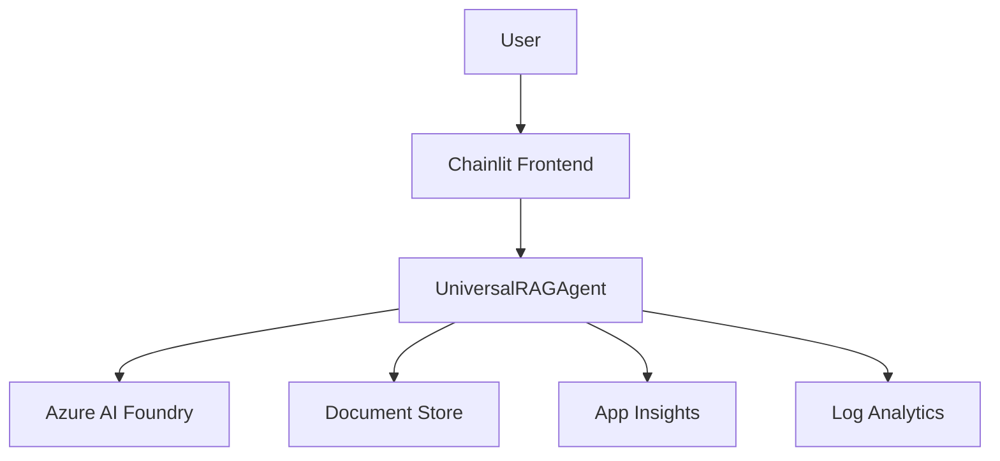

# Universal RAG Chat AI Foundry

> **Note**
> This project is in active development. Features and APIs may change.

---

## Overview

Universal RAG Chat AI Foundry is a cloud-native, extensible Retrieval-Augmented Generation (RAG) system for conversational AI. It enables users to upload documents, select models, and interact with advanced agents powered by Azure AI Foundry and Chainlit. The project is designed for modular deployment, scalability, and easy integration with Azure services.

---

## Features

- **Document Upload & Retrieval**: Ingest and search documents for context-aware chat.
- **Model Selection**: Choose between multiple LLM deployments (e.g., GPT-4.1-mini, GPT-4.1-nano).
- **Chainlit Frontend**: Modern UI for chat and agent interaction.
- **Azure AI Foundry Integration**: Secure, managed model hosting and deployment.
- **Telemetry & Monitoring**: Integrated with Azure Application Insights and Log Analytics.
- **Extensible Microservice Architecture**: Add new agents, tools, or models easily.

---

## Architecture



---

## Quickstart

### Prerequisites

- Docker
- Python 3.11+
- Azure CLI
- Azure subscription with AI Foundry enabled

### 1. Clone the repository

```bash
git clone https://github.com/bmoussaud/rag_chat_ai_foundry.git
cd rag_chat_ai_foundry
```

### 2. Deploy Infrastructure (Azure)

> [!IMPORTANT]
> All Azure resources are provisioned using Bicep. Do **not** use ARM, Terraform, or manual portal steps.

```bash
az login
az deployment group create \
  --resource-group <your-rg> \
  --template-file infra/main.bicep \
  --parameters environmentName=dev location=<azure-region>
```

### 3. Configure Environment

- Copy output values from deployment (e.g., `PROJECT_ENDPOINT`, `MODEL_DEPLOYMENT_NAME`, `APPLICATIONINSIGHTS_CONNECTION_STRING`) into `.env` or set as environment variables.

### 4. Install Python Dependencies

```bash
uv pip install -r src/universal_rag_chat/pyproject.toml
```

### 5. Run the Chainlit Frontend

```bash
cd src/universal_rag_chat
chainlit run main.py
```

---

## Project Structure

```
├── azure.yaml                # Azure Developer CLI project config
├── infra/                    # Bicep IaC modules
│   ├── main.bicep
│   ├── main.parameters.json
│   └── modules/
│       ├── ai-foundry.bicep
│       ├── app-insights.bicep
│       ├── container-app.bicep
│       ├── fetch-container-image.bicep
│       └── log-analytics-workspace.bicep
├── src/
│   └── universal_rag_chat/   # Main microservice
│       ├── main.py           # Chainlit entrypoint
│       ├── rag_agent.py      # Agent logic
│       ├── configuration.py  # Settings loader
│       ├── pyproject.toml    # Python dependencies
│       └── README.md         # (this file)
└── .github/
    └── instructions/         # Coding and infra guidelines
```

---

## Configuration

Set the following environment variables (or use `.env`):

- `PROJECT_ENDPOINT`: Azure AI Foundry project endpoint
- `MODEL_DEPLOYMENT_NAME`: Name of the deployed model
- `APPLICATIONINSIGHTS_CONNECTION_STRING`: App Insights connection string
- `AZURE_CLIENT_ID`: Managed Identity client ID (if used)
- `SETLISTFM_API_KEY`: (optional) for music/concert features

---

## Development & Extensibility

- Add new agents or tools by extending `rag_agent.py`.
- Use Bicep modules in `infra/modules/` for new Azure resources.
- Follow Python and Bicep best practices (see `.github/instructions/`).
- Use `uv` for dependency management.

---

## Monitoring & Telemetry

- Application Insights and Log Analytics are provisioned automatically.
- Alerts and metrics are configured via Bicep modules.

---

## Resources

- [Chainlit Documentation](https://docs.chainlit.io/)
- [Azure AI Foundry](https://learn.microsoft.com/en-us/azure/ai-foundry/)
- [Bicep Documentation](https://learn.microsoft.com/en-us/azure/azure-resource-manager/bicep/)

---

> [!TIP]
> For questions or issues, see the project `README.md` or contact the maintainer.
